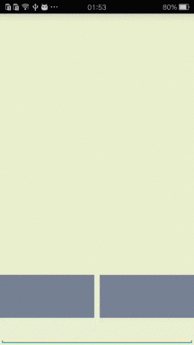
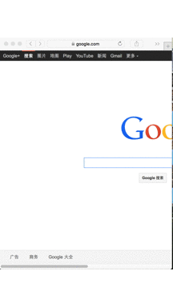

###MobileMouse###
####Control PC with app on android device####

This is a project which can be used for controlling the mouse pointer on PC with App on android device, you can move the mouse pointer, simulate mouse left click and right click. And you can typing text on app and text show up on PC.  

When you connect the macbook to TV with HDMI watching a movie, and you sitting on sofa. You don't need run to TV per every operation such as change another movie to watch or increase the volume... think about it, is it very easy to control PC or TV as if a super TV super remote control.  

###Demo###

———  

As below gifs, you can see the major functino of this app.    

###Client###

source code path: /client/MobileMouse  

####Use####
This app need run in wifi environment. When you start the app, please input the pc's ip address. You can leave the port field as empty.

###Server###

source code path: /server/mobilemouse 
 
**The server main code entrance:** `src/com/zhanglei/mobilemouse/main/MyServer.java`  

###Currently character set we support typing from app to pc###

* a ~ z
* A ~ Z
* 0 ~ 9
* backspace whitespace enter
* other: 

| ! | @ | # | % | ^ | & |
|:-:|:-:|:-:|:-:|:-:|:-:|
| * | ( | ) | - | = | _ |
| [ | ] | { | } | \ | \| |
| ; | : | ' | " | , | . |
| < | > | / | ? |